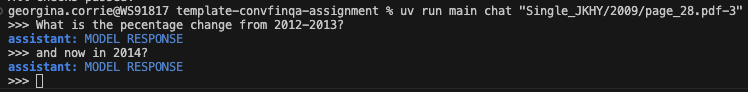

# ConvFinQA Assignment

We have cleaned up the dataset; please see `dataset.md` for more information. We recommend you use this version of the data for the assignment, as it will save you a lot of time. If you have any questions, please don't hesitate to ask your point of contact. 


Good luck! 

## Get started
### Prerequisites
- Python 3.12+
- [UV environment manager](https://docs.astral.sh/uv/getting-started/installation/)

### Setup
1. Clone this repository
2. Use the UV environment manager to install dependencies:

```bash
# install uv
brew install uv

# set up env
uv sync

# add python package to env
uv add <package_name>
```

### [optional] Use CLI to chat

We have created a boilerplate cli app using [typer](https://typer.tiangolo.com/) (sister of fastapi, built on click) so there is a simple chat interface, which you can extend to meet your needs if you so choose.  By default the chat responds with a standard message as shown below.


We've installed the app as a script, so you can run it with:
```bash 
uv run main
```
or you can use the longer form:
```bash
uv run python src/main.py
```

How to *chat*:
```bash
uv run main chat <record_id> 
```
[](figures/chat.png)  